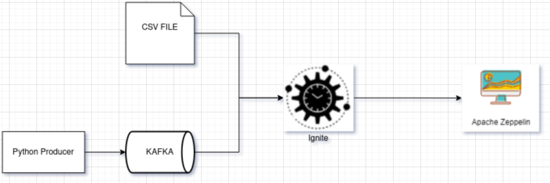
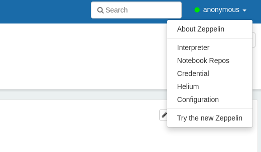
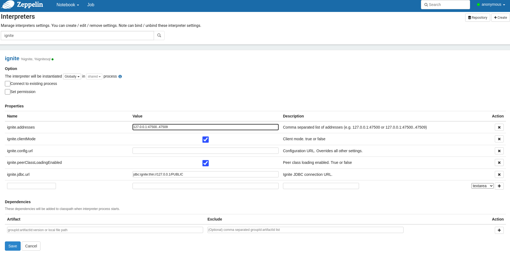
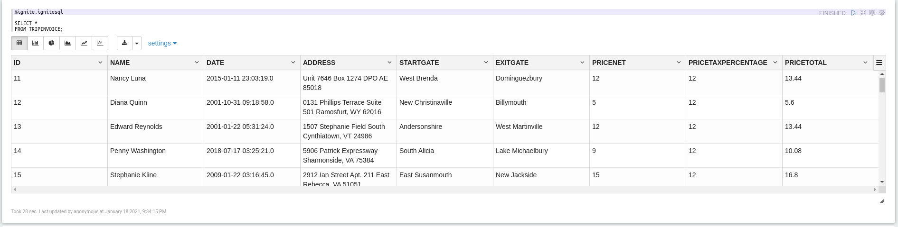
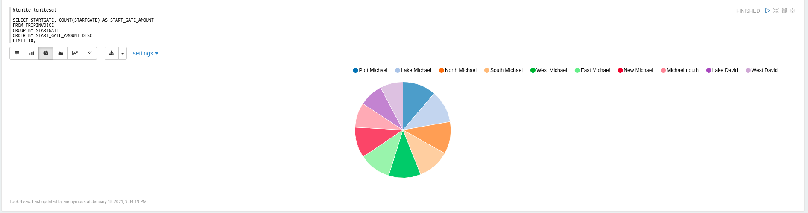

# Kafka - Ignite connector example

Example project shows how to integrate data from different sources (Kafka, direct file) into **Ignite** in-memory
DataGrid.



## Project components

### Kafka

To run project locally you need to have kafka installed. If you already have kafka up and running, you may need to
change broker address in `src/main/resources/application.yaml` and `producer/producer.py`

```bash
cd scripts
./install-kafka.sh
```

Installation script will create **.env** file which contain the path to `KAFKA_HOME`.

---

#### Run

```bash
cd scripts
./start-zookeeper.sh
./start-kafka.sh
```

Path to kafka is taken from `KAFKA_HOME` env variable or `KAFKA_HOME` from **.env** file.

### Python - Random data generation & Kafka Producer

Generate random invoice data with usage **faker** library and produce data into kafka topic, messages are sent in random
time (0-4 sec).

#### Run:

```bash
cd scripts
./start-producer.sh
```

### Kafka Consumer & Ignite Embedded - Spring

This component run `Ignite` in embedded mode and `Kafka Consumer`. Consumer read messages from the topic and
call `saveOrUpdate(TripInvoiceDto tripInvoiceDto)` method to save data into IgniteDB. After Dto transformation to
entity, request is saved in Ignite.

#### Run

```bash
cd scripts
./start-consumer.sh
```

#### Ignite Configuration

Whole ignite configuration you can find `src/main/java/greencashew/dev/ksic/analytics/AnalyticsConfiguration.java`

##### Persistent mode

Ignite by default works only in memory, to make Ignite save data in disk you need to set `setPersistenceEnabled(true)`
to true.

```java
private DataStorageConfiguration getStorageConfiguration(){
    final DataStorageConfiguration storageCfg=new DataStorageConfiguration();
    // Data would be saved on disk
    storageCfg.getDefaultDataRegionConfiguration().setPersistenceEnabled(true);
    log.info("Storage Persistence Enabled!");
    return storageCfg;
    }
```

##### Schema definition

In ignite we can set different cache mode:

- **Partitioned** - Quick WRITE - data evenly divided into an **entire cluster**
- **Replicated** - Quick READ - Data is replicated into **all members of the cluster**
- **Local mode** - No data is distributed to other nodes

You can set **Schema name** and **CacheMode** under **CacheConfiguration**:

```java
private CacheConfiguration getCacheConfiguration(){
    final CacheConfiguration config=new CacheConfiguration(CACHE_NAME);
    config.setCacheMode(CacheMode.REPLICATED);

    // Setting SQL schema for the cache.
    config.setIndexedTypes(Long.class,TripInvoice.class);
    return config;
    }
```

#### Client mode

In this example Ignite is running in embedded mode. Information how to run Consumer in client mode you can
find [here](https://ignite.apache.org/docs/latest/thin-clients/java-thin-client#connecting-to-cluster).

#### Core dependencies

```xml

<depedencies>
    <!-- Kafka -->
    <dependency>
        <groupId>org.apache.kafka</groupId>
        <artifactId>kafka-streams</artifactId>
    </dependency>
    <dependency>
        <groupId>org.springframework.cloud</groupId>
        <artifactId>spring-cloud-stream</artifactId>
    </dependency>
    <dependency>
        <groupId>org.springframework.cloud</groupId>
        <artifactId>spring-cloud-stream-binder-kafka-streams</artifactId>
    </dependency>

    <!-- Ignite -->
    <dependency>
        <groupId>org.apache.ignite</groupId>
        <artifactId>ignite-core</artifactId>
        <version>2.9.1</version>
    </dependency>
    <dependency>
        <groupId>org.apache.ignite</groupId>
        <artifactId>ignite-spring-data_2.2</artifactId>
        <version>2.9.1</version>
    </dependency>
</depedencies>
```

## Import CSV into Ignite - SQLLine

Sqlline is command line tool for connecting to relational DB through JDBC. It is provided with Ignite binaries or can be
downloaded directly from [developer page](https://github.com/julianhyde/sqlline)

So let's enter Ignite using default connection string `jdbc:ignite:thin://127.0.0.1/PUBLIC`

```bash
./sqlline.sh -u jdbc:ignite:thin://127.0.0.1/PUBLIC
```

In the beginning we need to remove header from our CSV file:

```csv
idTransit,startTime,endTime,startGate,exitGate,mileage,accountRegistrationTime,discout,discoutAmout,vehicleType,pricePerVehicle
```

As we open sql console under ignite, let's create table:

```sql
CREATE TABLE IF NOT EXISTS CarTolls
(
    idTransit INTEGER PRIMARY KEY,
    startTime TIMESTAMP,
    endTime TIMESTAMP,
    startGate VARCHAR,
    exitGate VARCHAR,
    mileage DOUBLE,
    accountRegTime TIMESTAMP,
    discout VARCHAR,
    discoutAmout INTEGER,
    vehicleType VARCHAR,
    pricePerVehicle DOUBLE
) WITH "CACHE_NAME=CarTolls, template=replicated";
```

```sql
No rows affected (0.966 seconds)
```

Next step is to import from CSV file:
Path is relative to your current console, but you can also put absolute `PATH`.

```sql
COPY FROM '/home/janek/projects/KafkaIgniteZeppelin/car-tolls.csv' INTO CarTolls (
    idTransit, startTime, endTime, startGate, exitGate,
    mileage, accountRegTime, discout, discoutAmout,
    vehicleType, pricePerVehicle
    ) FORMAT CSV;
```

```sql
2,299 rows affected (2.446 seconds)
```

Now let's check if fields were added:

```sql
SELECT *
FROM CarTolls;
```

Result:

```sql
+--------------------------------+--------------------------------+--------------------------------+--------------------------------+--------------------------------+--------------------------------+--------------------------------+
|           IDTRANSIT            |           STARTTIME            |            ENDTIME             |           STARTGATE            |            EXITGATE            |            MILEAGE             |         ACCOUNTREGTIME         |
+--------------------------------+--------------------------------+--------------------------------+--------------------------------+--------------------------------+--------------------------------+--------------------------------+
| 10                             | 2010-12-26 08:36:41.0          | 2020-01-16 04:41:37.0          | Katowice                       | Wroclaw                        | 3309.0                         | 2020-08-16 08:01:23.0          |
| 11                             | 2016-04-24 04:33:24.0          | 2011-06-05 00:28:07.0          | Tokio                          | Wroclaw                        | 4880.0                         | 2018-07-01 07:24:34.0          |
| 75                             | 2015-05-30 09:28:25.0          | 2012-08-04 00:43:06.0          | Katowice                       | Wroclaw                        | 626.0                          | 2019-11-23 14:16:05.0          |
| 93                             | 2010-09-13 04:12:56.0          | 2018-05-03 11:27:20.0          | Koper                          | Wroclaw                        | 3318.0                         | 2010-10-29 08:35:28.0          |
(...)
```

As you see all columns are not showed but still there are available if we call them directly.

### Zeppelin

Zeppelin is Web-based notebook for data analytics (like: Jupyter).

#### Install Zeppelin

```bash
cd scripts
./install-zeppelin.sh
```

Installation script will create **.env** file which contain the path to `ZEPPELIN_HOME`.

#### Run Zeppelin

```bash
cd scripts
./start-zeppelin.sh
```

Url to enter **Zeppelin**:
http://localhost:8080/

#### Add Ignite interpreter

To be able to connect Zeppelin to Ignite it is needed to add Ignite Interpreter. Ways to do that:

- Open **Interpreter** item in the drop-down menu



- Next step is to set Ignite Interpreter, default connection string:

```bash
jdbc:ignite:thin://127.0.0.1/PUBLIC
```



#### Notebook creation

To create notebook click `Create new note` button, it open modal on which you can provide notebook name and default
interpreter.

Example notes:




#### Stop Zeppelin

Stop:

```bash
cd scripts
./stop-zeppelin.sh
```

